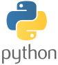

# Hi 👋, I Am Andrea

<!-- Actual text -->

&ensp;
 

I am a cloud engineer and I am interested in distributed systems.

I develop mainly in Python and Go. However, if necessary I dig into the low-level real of C or C++.

___

## 🥞 Tech Stack
 
I work with many different technologies and languages. 
My favorite ones are C++, Python, Go, and Docker.
 
&emsp;
&emsp;
&emsp;
&emsp;

  
 
 
## 📰 Recent articles on my Blog

 <!-- BLOG-POST-LIST:START -->
- [Argocd CAPA Certification Training - Workflows](https://andregri.github.io/argocd-capa-certification-training-workflows/)
- [Implementing an HTTP proxy in Go](https://andregri.github.io/http-proxy-in-go/)
- [Avoid name conflicts in Terraform workspaces](https://andregri.github.io/avoid-name-conflicts-in-terraform-workspace/)
- [Change Kubernetes service type from LoadBalancer to NodePort and viceversa](https://andregri.github.io/kubernetes-change-service-type/)
- [Kubernetes ephemeral containers](https://andregri.github.io/kubernetes-ephemeral-container/)
<!-- BLOG-POST-LIST:END -->
 
 
## :octocat: Recent Activities on GitHub

<!--START_SECTION:activity-->
1. 🎉 Merged PR [#3](https://github.com/andregri/terraform-azure-infrastructure/pull/3) in [andregri/terraform-azure-infrastructure](https://github.com/andregri/terraform-azure-infrastructure)
2. 💪 Opened PR [#3](https://github.com/andregri/terraform-azure-infrastructure/pull/3) in [andregri/terraform-azure-infrastructure](https://github.com/andregri/terraform-azure-infrastructure)
3. 🎉 Merged PR [#2](https://github.com/andregri/terraform-azure-infrastructure/pull/2) in [andregri/terraform-azure-infrastructure](https://github.com/andregri/terraform-azure-infrastructure)
4. 💪 Opened PR [#2](https://github.com/andregri/terraform-azure-infrastructure/pull/2) in [andregri/terraform-azure-infrastructure](https://github.com/andregri/terraform-azure-infrastructure)
5. 🎉 Merged PR [#1](https://github.com/andregri/terraform-azure-infrastructure/pull/1) in [andregri/terraform-azure-infrastructure](https://github.com/andregri/terraform-azure-infrastructure)
<!--END_SECTION:activity-->
 
---

## 🛠️ Most used Languages 

