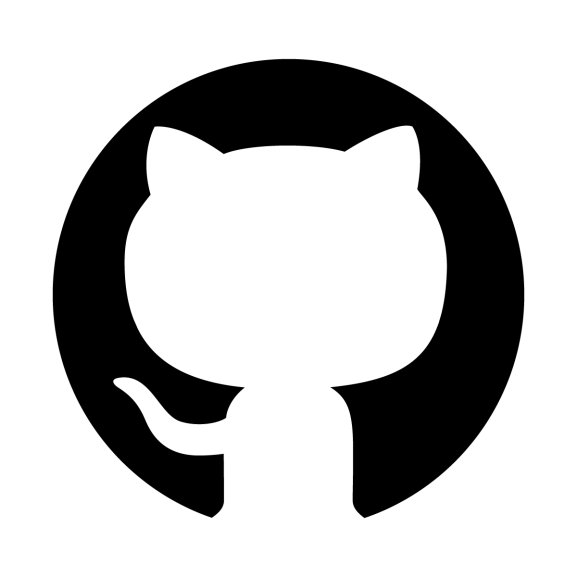

# Hi 👋, I Am Andrea

<!-- Actual text -->

&ensp;
 

I am working in Linux, C++, and Qt.

I am developing my personal projects with Python, Golang, and Docker.

I am learning Golang, Docker, Kubernetes, and cloud services.

I am interested in DevOps and cloud-native developments.

___

## 🥞 Tech Stack
 
I work with many different technologies and languages. 
My favorite ones are C++, Python, Go, and Docker.
 
&emsp;
&emsp;
&emsp;
&emsp;

  
 
 
## 📰 Recent articles on my Blog

 <!-- BLOG-POST-LIST:START -->
- [Kubernetes The Hard Way - Write Ansible inventory from template with Terraform](https://andregri.github.io/kthw-terraform-template/)
- [Inspecting HTTP Cache-Control](https://andregri.github.io/httpd-cache-control/)
- [Host a Go Gin web application with AWS S3 and EC2](https://andregri.github.io/Host-webapp-in-S3-and-EC2/)
- [Github ci/cd pipeline to deploy Azure App Service](https://andregri.github.io/Pipeline-to-deploy-App-Service/)
- [Merging a local repository to an existing remote repository](https://andregri.github.io/Merge-local-repository-to-existing-remote-repository/)
<!-- BLOG-POST-LIST:END -->
 
 
## :octocat: Recent Activities on GitHub

<!--START_SECTION:activity-->
1. ❗️ Opened issue [#177](https://github.com/blabla1337/skf-labs/issues/177) in [blabla1337/skf-labs](https://github.com/blabla1337/skf-labs)
2. ❗️ Opened issue [#5](https://github.com/massdriver-cloud/terraform-provider-jq/issues/5) in [massdriver-cloud/terraform-provider-jq](https://github.com/massdriver-cloud/terraform-provider-jq)
3. 💪 Opened PR [#197](https://github.com/scraly/developers-conferences-agenda/pull/197) in [scraly/developers-conferences-agenda](https://github.com/scraly/developers-conferences-agenda)
4. 💪 Opened PR [#6](https://github.com/andregri/andregri.github.io/pull/6) in [andregri/andregri.github.io](https://github.com/andregri/andregri.github.io)
5. 🎉 Merged PR [#5](https://github.com/andregri/andregri.github.io/pull/5) in [andregri/andregri.github.io](https://github.com/andregri/andregri.github.io)
<!--END_SECTION:activity-->
 
---

## 🛠️ Most used Languages 

